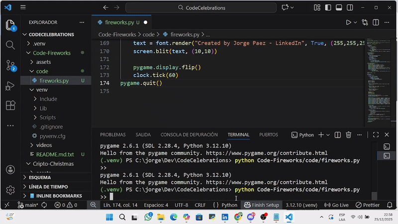

# 🎆 Code-Fireworks

A personal Python project that simulates a **fireworks display** with colorful animations, a snowman, stars, and a festive bouncing ball. Perfect for celebrating New Year or creating fun holiday visuals.

---

## 🎬 Demo




> The GIF above shows the main animation: fireworks, a snowman, stars, and a bouncing ball with realistic physics.

---

## 🗂 Project Structure

## 🖥 How to Run the Code

### 1️⃣ Requirements
- **Python 3.12.10** (tested and confirmed)
- Required packages:
  - `pygame 2.6.1`
  - `numpy 2.4.0`
  - `opencv-python` (if used)

> ⚠️ It's recommended to run the code in a **virtual environment** to avoid conflicts with other Python versions or packages.

### 2️⃣ Setup and Run
1. Create a virtual environment:

```bash
python -m venv venv

