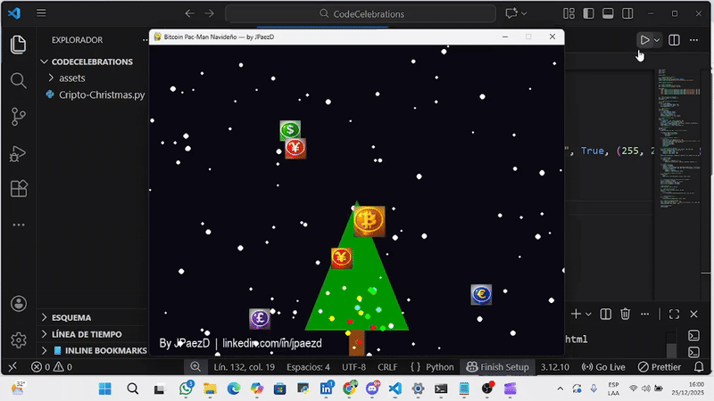

# 🎄 Cripto-Christmas

A personal project where I combined programming and creativity: I recorded my VSCode sessions while playing Pacman, adding audio and visual effects to make the process more engaging.

---

## 🎬 Demo Animation




## 📂 Project Structure

- `assets/` → Images and graphic resources used in the project.
- `videos/` → Final video with audio of the recording.
- `código/` → Scripts, for example `Cripto-Christmas.py`.
- `README.md` → This documentation.

---

## 🖥 How to Run the Code

1. Make sure Python 3 is installed.
2. Open a terminal and navigate to the `código` folder:
```bash
cd código
